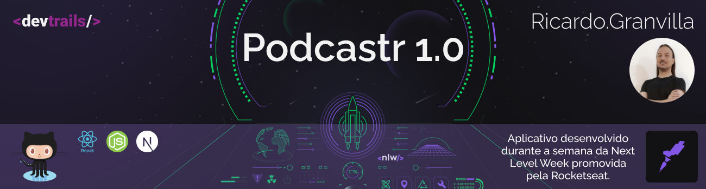
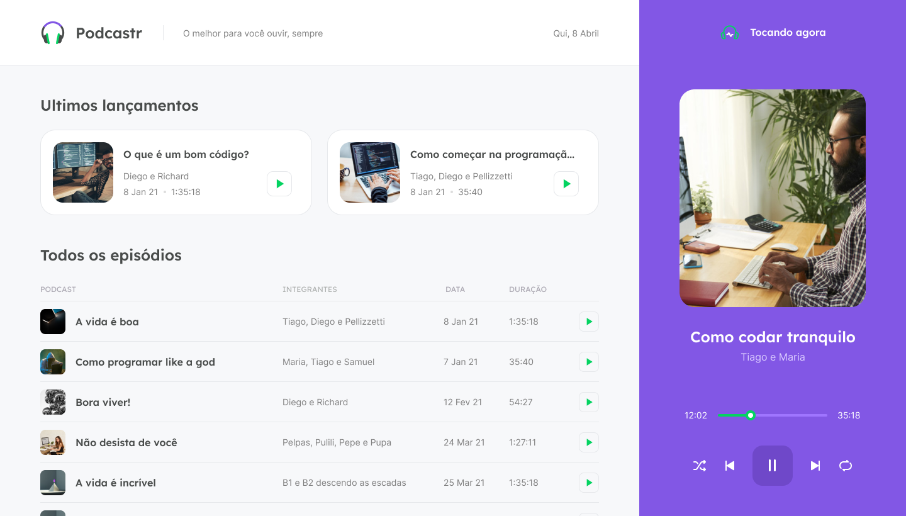
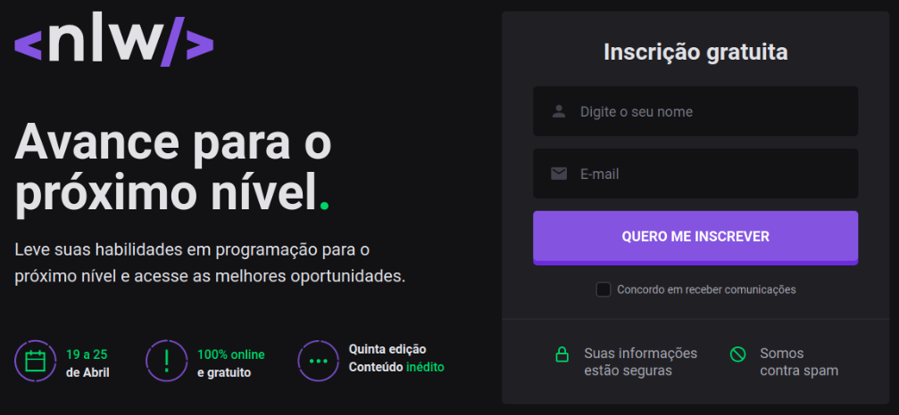

[](https://home.devtrails.com.br/)

<h3 align="center">
<br>
🚧 NLW#5 - Trilha ReactJS - Podcastr 1.0 🚀 em construção... 🚧
<br>
<br>

<p align="center">
  
  
  

  

  

  

</p>
</h3>

# Podcastr 1.0

<br>
<br>

## 💻 **Sobre o projeto**

<br>

Neste NLW#5 iremos desenvolver um web site para podcaster com o React, onde faremos uso das funcionalidade de Static Site Generation, através das ferramentas do nextjs, das Contexts API do React e da integração com Elementos Nativos do HTML.

<br>
<br>

## 📖 **Tabela de conteúdos**

<br>

- [Sobre o projeto](#-sobre-o-projeto)
- [Tabela de Conteúdo](#-tabela-de-conteúdos)
- [Funcionalidades](#-funcionalidades)
- [Layout](#-layout)
- [Tecnologias](#-tecnologias)
- [Pré-requisitos](#-pré-requisitos)
- [Autor](#-autor)

<br>

## 🔩 **Funcionalidades**

<br>

- [ ] Listar todos os episódios
- [ ] Listar os dois últimos lançamentos
- [ ] Criar um player para executar o podcast
- [ ] Criar uma página de conteúdo para cada podcast

<br>

## 🎨 **Layout**

<br>

<h3 align="center"><b> Web </b></h3>
<br>
<br>

<p align="center">
  
  
  <br>
  Home (nada tocando)
  <br>
  <br>
</p>
<p align="center">
  
  
  <br>
  Home executando o podcast
  <br>
  <br>
</p>
<p align="center">
  
  
  <br>
  Página do conteúdo do podcast
</p>
<br>
<br>

## 🛠 Tecnologias

<br>

Foram utilizadas as seguintes ferramentes no desenvolvimento do projeto:

- [JavaScript](https://developer.mozilla.org/pt-BR/docs/Web/JavaScript)
- [React](https://pt-br.reactjs.org/)
- [Next.js](https://nextjs.org/)

<br>
<br>

## 🖥 Pré-requisitos

<br>

Antes de começar, você vai precisar ter instalado em sua máquina as seguintes ferramentas [Git](https://git-scm.com), [Node.js](https://nodejs.org/en/).

Além disto é bom ter um editor para trabalhar com o código como [VSCode](https://code.visualstudio.com/).
<br>
<br>

### 💽 Copiando o repositório

<br>

Com o Github instalado no seu computador, abra o terminal acesse a pasta onde deseja baixar o repositório e execute o comando abaixo.

```bash
# Clone este repositório
$ git clone git@github.com:rgranvilla/nlw-5_Podcastr_Next.git

# Acesse a pasta do projeto no terminal/cmd
$ cd podcastrnext


# Instale as dependências
$ yarn

# Execute a aplicação em modo de desenvolvimento
$ yarn dev

# O servidor inciará na porta:3000 - acesse <http://localhost:3000>
```

<br>
<br>

<h2 align="center">

🎉 Parabéns! 🎉

</h1>

<p align="center">


</P>
<br>

Se você chegou até aqui, estará com o aplicativo rodando em sua máquina. Sinta-se a vontade para modificar, melhorar e sugerir modificações na aplicação.
Se você gostou do repositório marque uma **Estrela** 🌟.

<br>
<br>

# 🤓 Autor

<br>
<p align="center">
Importante: esse aplicativo é de autoria da Rocketseat desenvolvido para a Next Level Week #5
<br>
<br>

<a href="https://nextlevelweek.com/inscricao/5">



<p align="center">
acesse e inscreva-se ou aguarde a nova edição
</p>
</a>
<br>
</p>

## Podcastr Versão 1.1 por:

<br>

[](https://github.com/rgranvilla)

<a href="https://github.com/rgranvilla">Ricardo Granvilla 🚀</a>

Desenvolvido com muito carinho 😉 para você 👋 Entre em contato!
<br>

[](https://twitter.com/rgranvilla) [](https://www.linkedin.com/in/rgranvilla/) [](mailto:rgranvilla@gmail.com)

<br>
<br>
